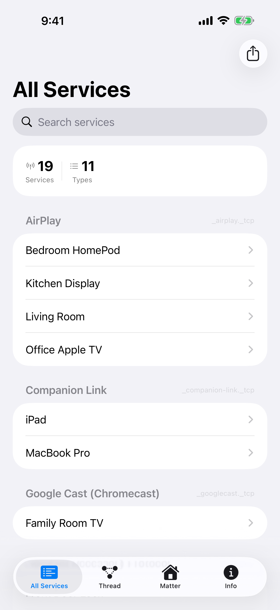
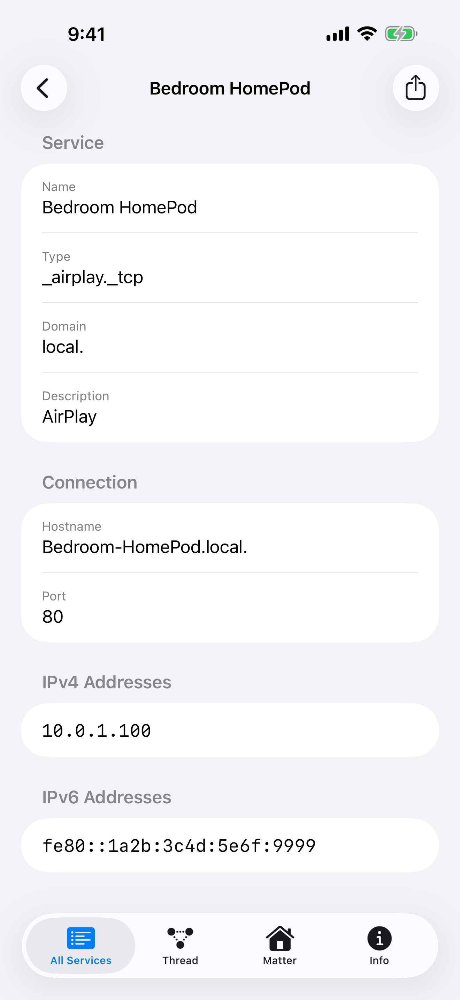
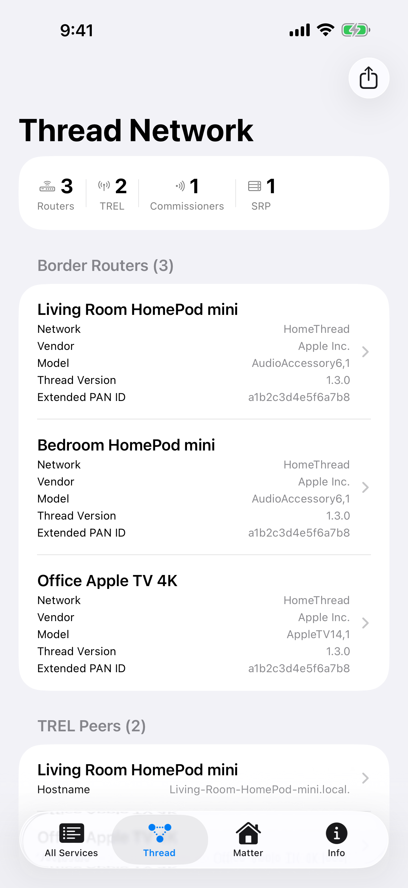
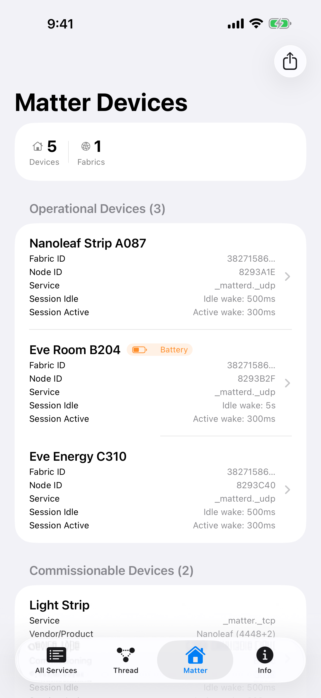

# Herald

A network discovery app for iOS that browses Bonjour (mDNS/DNS-SD) services on your local network and displays detailed service information.

Herald discovers announced service on your network — AirPlay speakers, printers, Thread border routers, Matter devices, and more — and shows their hostname, IP addresses, port, and TXT records.

**App Store** [Herald](https://apps.apple.com/us/app/herald-bonjour-dns-sd/id6759459419) | **Website:** [heraldapp.app](https://heraldapp.app)

<p align="center">
  
  
  
  
</p>

## Features

- **All Services** — Browse and search every Bonjour service on the network, grouped by type with human-readable descriptions
- **Service Detail** — Tap any service to see its hostname, port, IPv4/IPv6 addresses, and TXT record entries
- **Thread Network** — Dedicated view for Thread border routers showing network name, vendor, model, and thread version
- **Matter Devices** — Discover Matter-compatible smart home devices on the network
- **Export** — Share or export discovered services as a text file (json or plain text)
- **Siri & Shortcuts** — Ask Siri "How many Matter devices are on my network with Herald" to count Matter devices; tap the result to open the app to the Matter tab

## Requirements

- iOS 17+
- Xcode 16+

### Local Build Settings

To build for a device or submit to the App Store, create a local config with your signing identity:

```bash
cp Herald/Local.xcconfig.template Herald/Local.xcconfig
```

Edit `Herald/Local.xcconfig` and set your Apple Developer Team ID and bundle identifier. This file is gitignored.

> **Note:** `Local.xcconfig` is optional for simulator builds using `CODE_SIGNING_ALLOWED=NO`.

### Building

```bash
# Build (compilation check, no signing required)
xcodebuild -project Herald/Herald.xcodeproj \
  -scheme Herald -destination 'generic/platform=iOS' \
  -configuration Debug CODE_SIGNING_ALLOWED=NO build

# Build and run on a simulator
xcodebuild -project Herald/Herald.xcodeproj \
  -scheme Herald -destination 'platform=iOS Simulator,name=iPhone 16' build
```

## Testing

```bash
# Run UI and Unit tests (excludes screenshot tests)
xcodebuild -project Herald/Herald.xcodeproj \
  -scheme Herald -destination 'platform=iOS Simulator,name=iPhone 16' \
  -testPlan UnitTestPlan test
```

## Linting

SwiftLint is included as a local SPM command plugin — no global install needed.

```bash
./scripts/lint.sh          # Lint all sources
./scripts/lint.sh --fix    # Auto-fix
```

## Architecture

### Discovery Flow

```
Service Types (Info.plist) → Instance Browsing → On-Demand Resolution
```

1. `BonjourDiscoveryEngine` reads known service types from `NSBonjourServices` in Info.plist
2. `ServiceInstanceBrowser` browses instances per type via dns_sd (`DNSServiceBrowse`)
3. `ServiceResolver` resolves details via dns_sd when a user taps a service

### MVVM Pattern

- **Services** (`@MainActor`, `ObservableObject`) — Own network state, expose `@Published` properties
- **ViewModels** — Compose services and expose state for views
- **Views** — SwiftUI with `NavigationStack` and typed `navigationDestination(for:)`

## Project Structure

```
Herald/
├── Herald.xcodeproj
└── Herald/
    ├── App/                    # App entry point, ContentView, NavigationState
    ├── AppIntents/             # Siri intents (CountMatterDevicesIntent, MatterDeviceCounter, HeraldShortcuts)
    ├── Models/                 # ServiceInstance, ResolvedService, ThreadNetworkInfo, etc.
    ├── Services/
    │   ├── Discovery/          # DNSSDService, ServiceInstanceBrowser, ServiceResolver
    │   ├── Thread/             # ThreadNetworkService
    │   ├── Matter/             # MatterDeviceService
    │   └── BonjourDiscoveryEngine.swift
    ├── ViewModels/             # ServiceDetailViewModel, ThreadNetworkViewModel, etc.
    ├── Views/
    │   ├── AllServices/        # AllServicesView, ServiceDetailView
    │   ├── Thread/             # ThreadNetworkView
    │   ├── Matter/             # MatterDeviceView
    │   ├── Info/               # InfoView
    │   └── Common/             # Shared components (ErrorRow, LabeledRow, ExportToolbarModifier, etc.)
    ├── Utilities/              # ServiceTypeDescriptions, ServiceExporter, TXTRecordLabels, etc.
    └── Resources/              # Info.plist, Herald.entitlements, app icons
```

## Adding New Service Types

1. Add the type string (e.g. `_http._tcp`) to `NSBonjourServices` in `Info.plist`
2. Add a human-readable description to `ServiceTypeDescriptions.swift`

## App Store Screenshots

```bash
./scripts/capture_screenshots.sh
```

Captures screenshots on three simulators with a clean status bar (9:41, full battery, no carrier). Output is organized into `screenshots/6.7-inch/`, `screenshots/6.9-inch/`, and `screenshots/iPad-13-inch/`.

| Simulator              | Pixels       | App Store Connect section |
|------------------------|--------------|---------------------------|
| iPhone 14 Plus         | 1284 × 2778  | 6.7" Display              |
| iPhone 16 Pro Max      | 1320 × 2868  | 6.9" Display              |
| iPad Pro 13-inch (M4)  | 2064 × 2752  | iPad 13" Display          |

## License

This project is available under the MIT License. See [LICENSE](LICENSE) for details.
